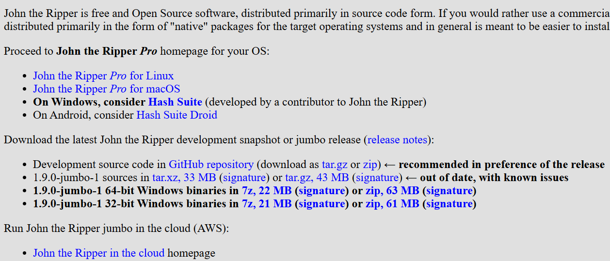
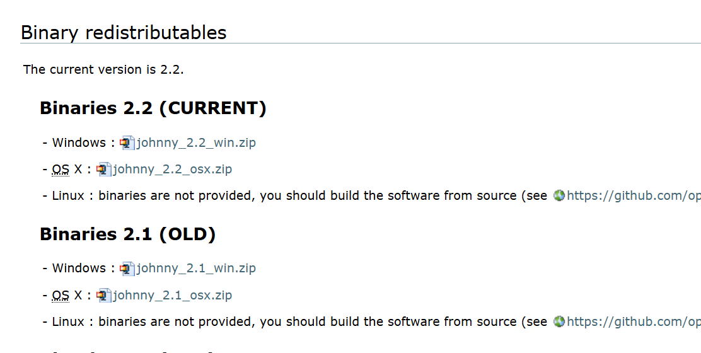
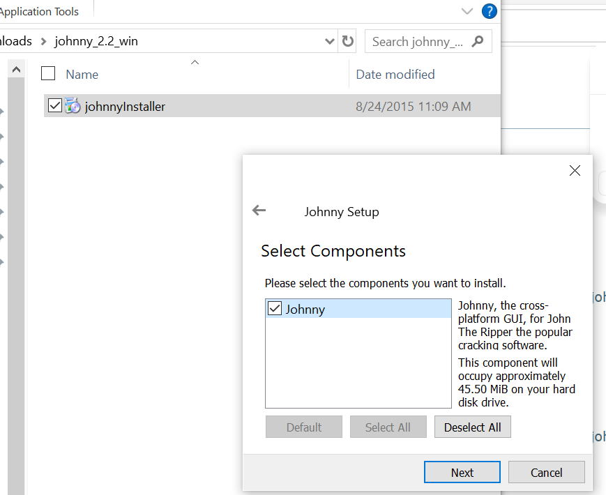
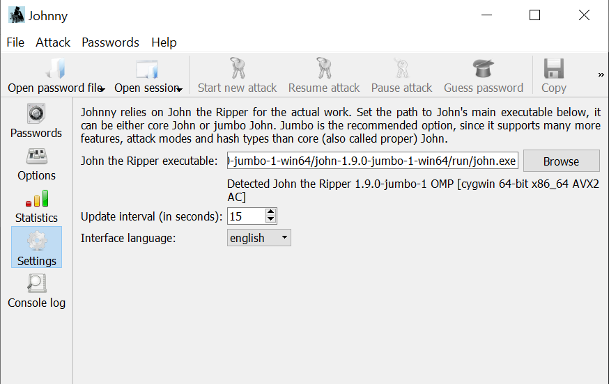
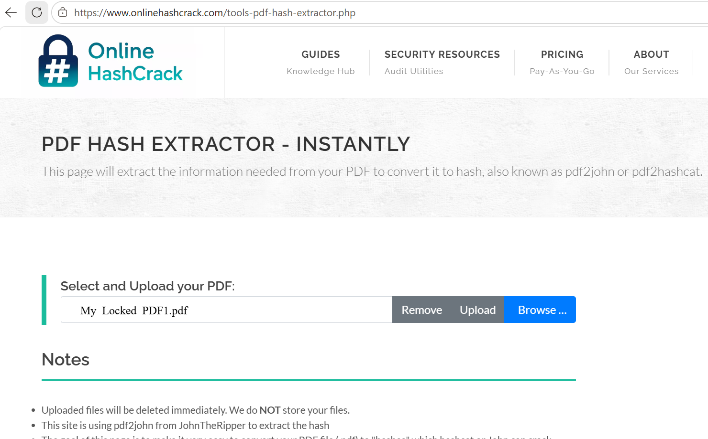
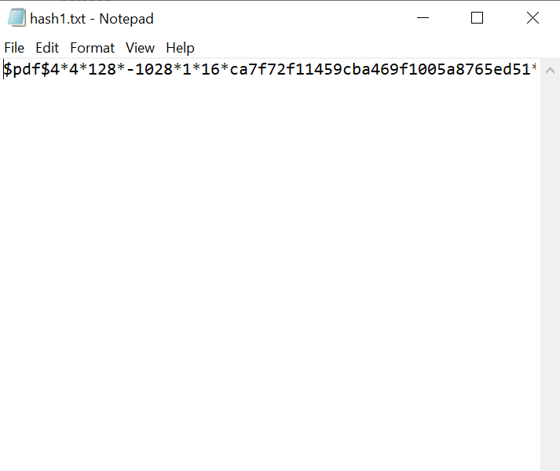
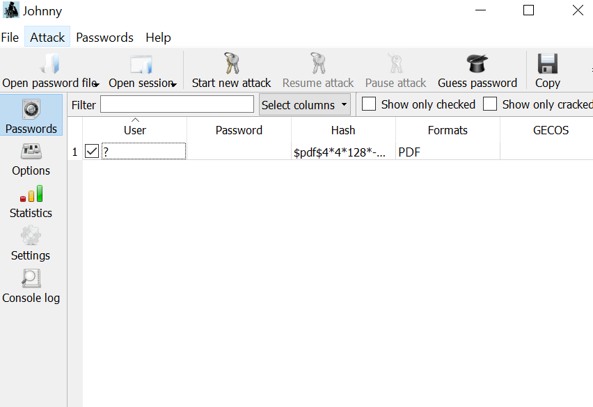
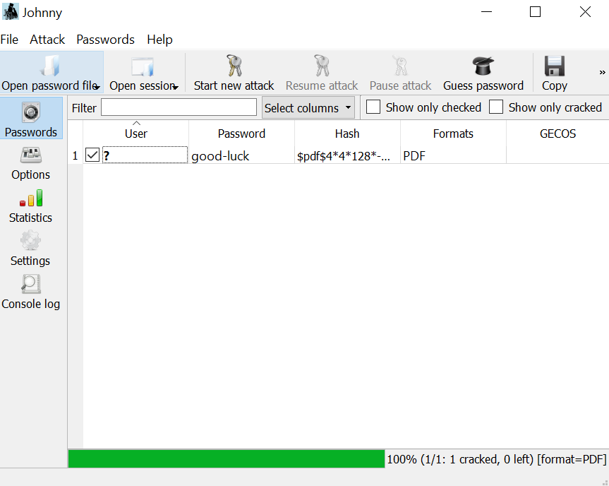
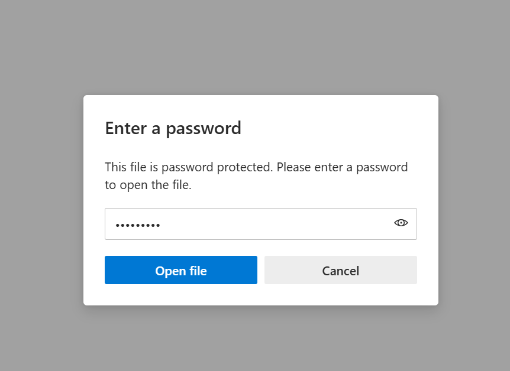

# W3-PM1 – Password Cracking with John the Ripper and Johnny

## Overview

This project documents the Week 3 practical task on PDF password recovery using **John the Ripper (JTR)** and **Johnny**, a graphical interface for John the Ripper.

The task involved working with an encrypted PDF provided as part of the NetworkWalks cybersecurity training. The PDF hash was extracted, saved as a text file, loaded into Johnny, and processed using a password-cracking attack. The recovered password was then used to open the protected PDF and verify the result.

All activities were performed as part of an authorized cybersecurity training exercise.

---

## Objective

The objective of this practical was to:

- Understand the basic process of password recovery from a protected PDF.
- Set up John the Ripper and Johnny on a Windows PC.
- Extract the password hash from an encrypted PDF.
- Save and load the hash into Johnny.
- Perform a password-cracking attack using John the Ripper.
- Use the recovered password to open the protected PDF.
- Capture evidence of the completed task.

---

## Tools Used

| Tool | Purpose |
|---|---|
| John the Ripper | Password-cracking engine |
| Johnny | Graphical interface for John the Ripper |
| Online PDF Hash Extractor | Extracted the PDF password hash |
| Notepad | Saved the extracted hash as a text file |
| Windows PC | Host environment for the practical |

---

## Task Description

The assigned task was to crack the password of an attached encrypted PDF using **John the Ripper (JTR)** and **Johnny**.

The general workflow was:

1. Download John the Ripper.
2. Download and install Johnny.
3. Configure Johnny to use the John the Ripper executable.
4. Obtain the encrypted PDF provided for the training task.
5. Extract the PDF password hash.
6. Save the hash as a text file.
7. Load the hash into Johnny.
8. Start the password-cracking attack.
9. Use the recovered password to open the encrypted PDF.
10. Verify the successful completion of the task.

---

## Procedure

### 1. Download John the Ripper

John the Ripper was downloaded from the official Openwall distribution.

**Purpose:**  
John the Ripper provides the password-cracking engine required for the practical.

**Evidence:**

---

### 2. Download Johnny

Johnny, the graphical interface for John the Ripper, was downloaded for Windows.

**Purpose:**  
Johnny provides a graphical interface that makes it easier to configure and run John the Ripper.

**Evidence:**

---

### 3. Install Johnny

Johnny was installed on the Windows PC using the downloaded installer.

**Evidence:**

---

### 4. Configure John the Ripper in Johnny

After installation, Johnny was opened and configured to use the `john.exe` executable from the John the Ripper `run` folder.

During the setup, an earlier John the Ripper package caused difficulties with Johnny detecting the executable. A newer official John the Ripper package was subsequently downloaded and its `john.exe` file was successfully detected by Johnny.

**Evidence:**

---

### 5. Extract the PDF Password Hash

The encrypted PDF was uploaded to a PDF hash extraction tool.

The tool generated a PDF password hash beginning with the `$pdf$` format identifier.

The complete hash was copied for use with John the Ripper.

**Evidence:**

---

### 6. Save the Hash as a Text File

The extracted hash was pasted into Notepad and saved as:

`hash1.txt`

This text file was used as the password file input for Johnny.

**Evidence:**

---

### 7. Load the Hash into Johnny

The `hash1.txt` file was opened through Johnny using the password file option.

Johnny recognized the input as a PDF hash and prepared it for the attack.

**Evidence:**

---

### 8. Start the Password-Cracking Attack

A new attack was started in Johnny.

John the Ripper processed the PDF hash and successfully recovered the password.

The attack reached 100% completion and showed that the password had been cracked.

**Evidence:**

---

### 9. Enter the Recovered Password

The recovered password was entered into the encrypted PDF.

This allowed the protected PDF to be opened successfully.

**Evidence:**

---

### 10. Verify the Result

After entering the recovered password, the PDF opened successfully and displayed the NetworkWalks completion page confirming that the training flag had been captured.

**Evidence:**

---

## Troubleshooting

### John the Ripper executable was not initially detected

During the setup of Johnny, the first John the Ripper package did not work correctly with the Johnny interface.

The executable path was not initially accepted by Johnny.

**Resolution:**

- Checked the location of the `john.exe` executable.
- Tested John the Ripper directly from Windows Command Prompt.
- Downloaded a newer official John the Ripper package.
- Verified that the new executable could run successfully.
- Configured Johnny to use the working `john.exe` file.
- Johnny then successfully detected John the Ripper.

### Security software interference

During the setup process, the installed security software generated warnings involving Johnny and its maintenance process.

The security prompts were reviewed and the relevant activity was blocked where necessary while continuing with the authorized lab setup.

After resolving the interference, Johnny was able to work correctly with John the Ripper.

---

## Result

The encrypted training PDF was successfully processed using John the Ripper through Johnny.

The password was recovered successfully, the protected PDF was opened, and the NetworkWalks training flag was captured.

The practical task was therefore completed successfully.

---

## Lessons Learned

- Password-protected files can be tested for password strength using password-cracking tools in an authorized environment.
- John the Ripper provides the password-cracking engine, while Johnny provides a graphical interface for easier interaction.
- Correct configuration of supporting tools and executable paths is important before beginning an attack.
- Testing an executable directly can help identify whether a problem is caused by the application or its graphical interface.
- Troubleshooting software and security-tool interference is an important part of practical cybersecurity work.
- Password-cracking activities should only be performed on files and systems where permission has been granted.

---

## Ethical and Legal Disclaimer

This practical was performed strictly as part of an authorized cybersecurity training exercise using a training PDF provided for the task.

Password-cracking tools can be used for legitimate security testing and password recovery, but they must not be used to access files, accounts, or systems without authorization.

No unauthorized access, data theft, system disruption, or exploitation was performed during this exercise.

---

## Conclusion

This practical provided hands-on experience with John the Ripper and Johnny for recovering a password from an encrypted PDF.

The exercise covered the complete workflow from hash extraction and preparation through password recovery and verification. It also provided practical troubleshooting experience when configuring John the Ripper and Johnny on Windows.

The successful completion of the task demonstrated a basic understanding of password-cracking workflows within a controlled cybersecurity training environment.
