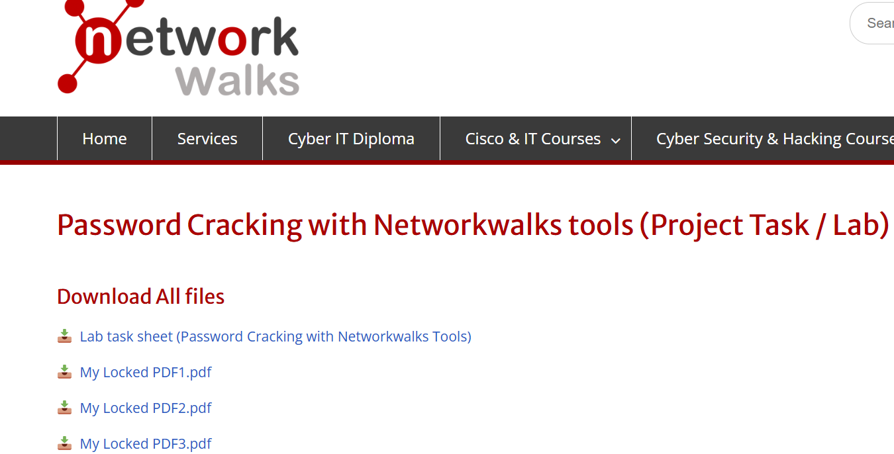
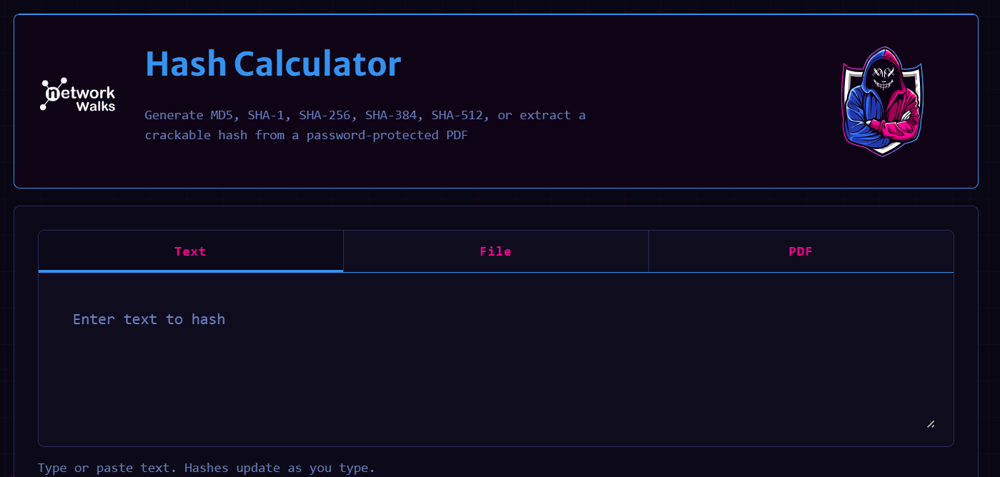
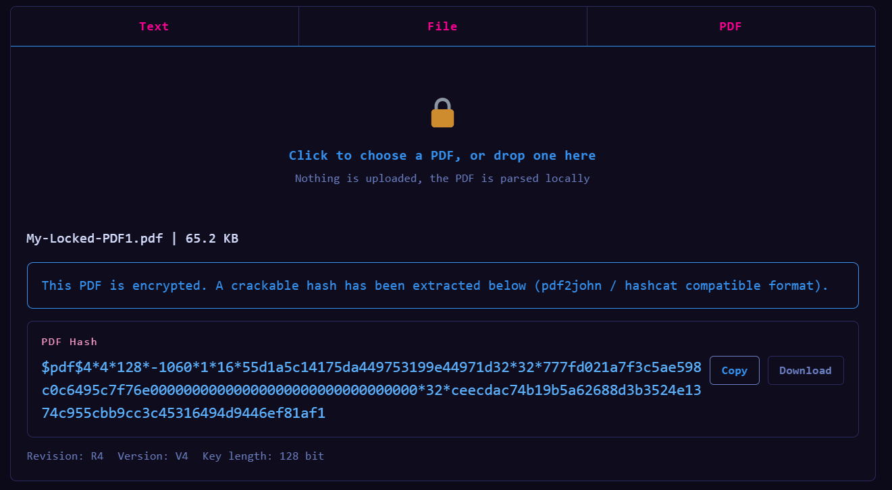
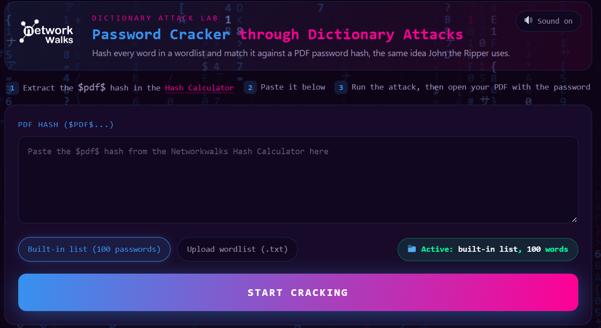
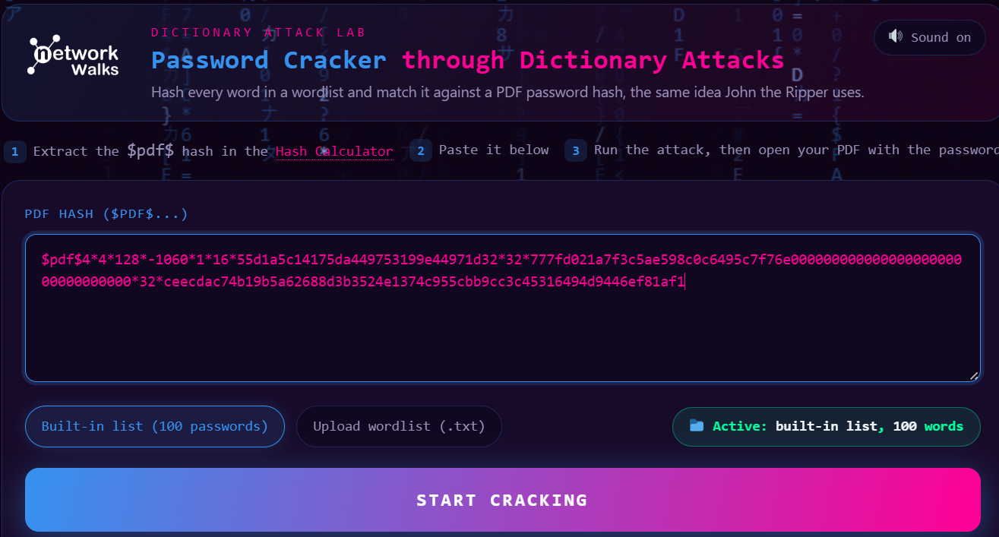
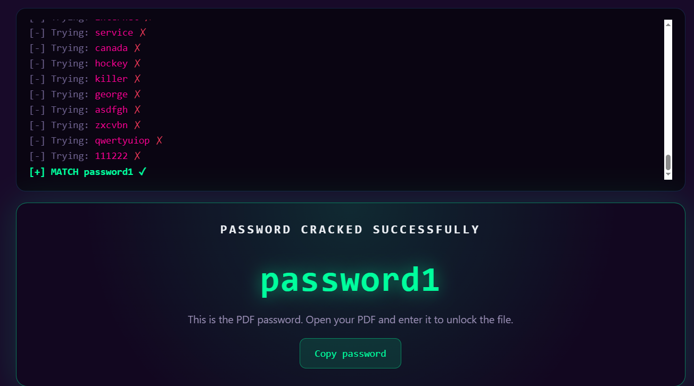
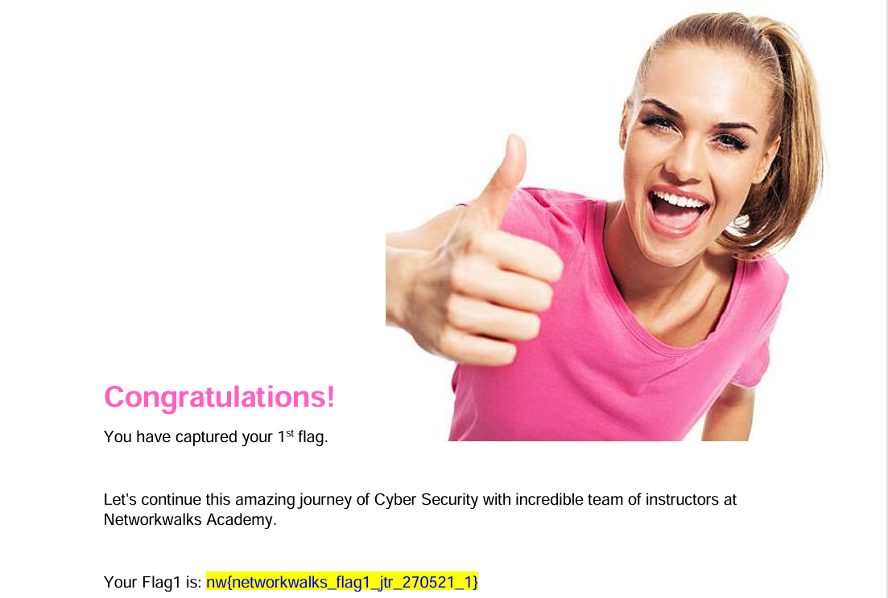

# W3-PM2 – Password Cracking with NetworkWalks Tools

## Overview

This project documents the Week 3 practical task on PDF password recovery using the **NetworkWalks Hash Calculator** and **NetworkWalks Password Cracker**.

The task involved downloading an encrypted PDF provided through the NetworkWalks training lab, extracting its password hash using the Hash Calculator, and using the Password Cracker to recover the password. The recovered password was then used to open the protected PDF and verify the successful completion of the task.

All activities were performed as part of an authorized cybersecurity training exercise.

---

## Objective

The objective of this practical was to:

- Understand the basic concept of password recovery from a protected PDF.
- Use the NetworkWalks Hash Calculator to extract a PDF password hash.
- Use the NetworkWalks Password Cracker to process the extracted hash.
- Recover the password from the provided training file.
- Use the recovered password to open the protected PDF.
- Capture evidence of the completed task.

---

## Tools Used

| Tool | Purpose |
|---|---|
| NetworkWalks Hash Calculator | Extracted the password hash from the encrypted PDF |
| NetworkWalks Password Cracker | Processed the hash and recovered the password |
| Web Browser | Accessed the NetworkWalks online tools |
| My Locked PDF1 | Training file used for the practical |

---

## Task Description

The assigned task was to crack the password of the provided encrypted PDF using the NetworkWalks Hash Calculator and Password Cracker tools.

The workflow was:

1. Download the encrypted PDF from the NetworkWalks training lab.
2. Open the NetworkWalks Hash Calculator.
3. Upload the encrypted PDF.
4. Generate and copy the PDF password hash.
5. Open the NetworkWalks Password Cracker.
6. Paste the extracted hash.
7. Start the password-cracking process.
8. Wait for the password to be recovered.
9. Use the recovered password to open the encrypted PDF.
10. Verify the successful completion of the task.

---

## Procedure

### 1. Download the Encrypted PDF

The encrypted PDF provided for the practical was downloaded from the NetworkWalks project task lab.

**Purpose:**  
The file served as the authorized training target for the password-recovery exercise.

**Evidence:**

---

### 2. Open the NetworkWalks Hash Calculator

The NetworkWalks Hash Calculator was opened in a web browser.

The tool provides a way to extract the password hash from a supported protected PDF.

**Evidence:**

---

### 3. Generate the PDF Hash

The encrypted PDF was uploaded to the Hash Calculator.

The tool generated a PDF password hash beginning with the `$pdf$` format identifier.

The generated hash was copied for use with the NetworkWalks Password Cracker.

**Evidence:**

---

### 4. Open the NetworkWalks Password Cracker

The NetworkWalks Password Cracker was opened in the browser.

This tool is designed to process the extracted password hash and attempt to recover the original password.

**Evidence:**

---

### 5. Paste the Hash and Prepare the Attack

The extracted PDF hash was pasted into the Password Cracker.

The available password list was displayed and the tool was ready to begin the cracking process.

**Evidence:**

---

### 6. Recover the Password

The password-cracking process was started.

The NetworkWalks Password Cracker successfully identified the password and displayed a successful password-cracked result.

**Evidence:**

---

### 7. Open the Protected PDF and Verify the Result

The recovered password was entered into the encrypted PDF.

The PDF opened successfully and displayed the NetworkWalks completion page confirming that the training flag had been captured.

**Evidence:**

---

## Result

The encrypted training PDF was successfully processed using the NetworkWalks Hash Calculator and Password Cracker.

The password was recovered successfully, the protected PDF was opened, and the NetworkWalks training flag was captured.

The practical task was therefore completed successfully.

---

## Lessons Learned

- A protected PDF can contain a password hash that can be processed during an authorized password-recovery exercise.
- Hash extraction and password recovery are separate stages of the password-cracking workflow.
- The NetworkWalks Hash Calculator can be used to obtain the required PDF hash.
- The NetworkWalks Password Cracker can process the extracted hash and attempt password recovery.
- Weak or commonly used passwords can be recovered more easily by password-cracking tools.
- Password-cracking activities should only be performed against files or systems where authorization has been provided.

---

## Ethical and Legal Disclaimer

This practical was performed strictly as part of an authorized cybersecurity training exercise using a training PDF provided for the task.

Password-cracking tools can be used for legitimate security testing and password recovery, but they must not be used to access files, accounts, or systems without authorization.

No unauthorized access, data theft, system disruption, or exploitation was performed during this exercise.

---

## Conclusion

This practical provided hands-on experience with the NetworkWalks Hash Calculator and Password Cracker.

The exercise demonstrated the basic workflow of extracting a password hash, processing the hash through a password-cracking tool, recovering the password, and verifying access to the protected training file.

The successful completion of the task improved my understanding of password-cracking concepts and the importance of using strong passwords within a controlled cybersecurity training environment.
